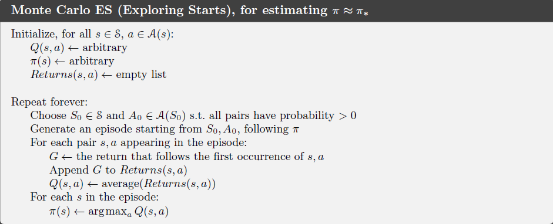

## Monte Carlo Methods
本章开始我们不再假设我们拥有对于环境的完全信息，另外我们主要讨论episodic tasks。蒙特卡洛方法与我们在第二章当中接触的类似，但是由于采取的动作所导致的即期收益还取决于当前状态，因此在初始状态的情况下，整个问题是非平稳的，这是与第二章的主要区别。

### Monte Carlo Prediction

我们先讨论使用蒙特卡洛方法来学习给定策略之下的状态值函数。首先我们定义a visit to s 是each occurrence of state s in an episode。The *first-visit MC Method* 使用每一个episode中的第一次visit取平均后来估计$v_\pi(s)$，the *every-visit MC Method*使用的则是全部的visit。前者中每次关于s收益的回报是独立同分布且具有有限方差的无偏估计，后者则是有相关性的（因为是使用了相同的策略得到的），但是后者的收敛速度也被证明是$o(\frac{1}{n^2})$级别的。

如果一个系统的信息是不完全的，那么估计状态-动作值比起估计状态值会更加实际。因为当具有完全的系统信息时，只需要根据状态值向前根据概率加权即可得到每一个动作的期望回报，因此可以求得最优动作，但是这在不完全信息的系统下是做不到的。但是估计状态-动作值函数也有一个问题，那就是当我们采用的是确定性的策略的时候，对每一个状态而言我们只会观测到一个状态-动作对（因为总是会选择那一个最优的动作），这样没有其他样本进行平均，蒙特卡洛方法对于其他状态-动作值得估计将没办法进行。其中一种方法则是确保在每一个episodes的开始即给定了一种状态-动作对，并且任何状态-动作对都有正的被选中的概率在蒙特卡洛方法的开始。这种假设我们称为 exploring starts。但是对于直接从现实环境中学习的策略而言，这样的强行改变学习过程的开始是不可行的。因此最常用的解决办法是只考虑对于所有状态-动作对都具有正概率选取的随机策略。

在Monte Carlo ES算法中，所有的状态-动作值都被用来平均来估计真实值，不管它是由哪一个策略产生的，但是这不会造成算法收敛到非最优策略上，因为一旦收敛到非最优策略上，值函数也会收敛到对应的值函数，那么进行策略提升的时候回破坏这个平衡从而继续提升。但是收敛性的证明还没有被彻底解决。

为了放松Exploring Starts这个假设，可以采用两种替代方法：1. *on-policy* methods 2.*off-policy* methods. On-policy策略尝试去评估并且提升目前正在被使用的策略，而 Off-policy 则是评估或者提升非当前正在使用的策略。上面提到的Monte Carlo ES算法就是一种on-policy的算法。

在on-policy方法中，policy 一般都是soft的，即$\pi(a|s)>0\ for\ all\ s\in S \and a\in A(s)$，但是最终会趋向于一个确定性的策略。我们采用$\epsilon-greedy$策略，这是一种$\epsilon-soft$策略，即$\pi(a|s)\geq \frac{\epsilon}{|A(s)|}$。与Monte Carlo ES相似的是，我们使用first-visit MC方法来估计当前策略的动作-状态值，但是在提升策略的时候我们不能简单地进行贪心迭代，因为这样会降低其对于其他贪心策略的探索。事实上GPI (General Policy Iteration)也不要求策略要一直使用贪心提升，只要求它向着贪心策略趋近即可，因此在我们的方法中我们将策略提升到任意一个$\epsilon$-greedy 策略。事实上给定$q_\pi$，任意一个$\epsilon$-greedy 策略都比任意一个$\epsilon-soft$策略要好。证明如下：
$$
\begin{aligned} q_{\pi}\left(s, \pi^{\prime}(s)\right) &=\sum_{a} \pi^{\prime}(a | s) q_{\pi}(s, a) \\ &=\frac{\epsilon}{|\mathcal{A}(s)|} \sum_{a} q_{\pi}(s, a)+(1-\varepsilon) \max _{a} q_{\pi}(s, a) \\ & \geq \frac{\epsilon}{|\mathcal{A}(s)|} \sum_{a} q_{\pi}(s, a)+(1-\varepsilon) \sum_{a} \frac{\pi(a | s)-\frac{\epsilon}{|\mathcal{A}(s)|}}{1-\varepsilon} q_{\pi}(s, a)\\ 
&=\frac{\epsilon}{|\mathcal{A}(s)|} \sum_{a} q_{\pi}(s, a)-\frac{\epsilon}{|\mathcal{A}(s)|} \sum_{a} q_{\pi}(s, a)+\sum_{a} \pi(a | s) q_{\pi}(s, a) \\ 
&=v_{\pi}(s)
\end{aligned}
$$
（证明的突破口在于在新的策略之下找到原来策略的成分）

### Off-policy Prediction via Importance Sampling

所有学习控制都面临这样一种困境：它们尝试去在一系列最优动作中学习最优的动作值函数，但是它们需要表现得非最优来探索所有动作。怎么可以做到在执行非最优策略的同时还能学习到最优策略呢？on-policy方法实际上提出了一种妥协：它不是从最优策略来学习动作值函数，而是从一个还在探索的近似最优策略中学习的。另外一种更加直接的方式，则是采用两种策略，一种用来学习从而提升到最优策略，另外一种则更加具有探索性来产生行为。用于学习的策略被称为target policy而用于产生数据的策略被称为behavior policy。在这种情况下面数据是off the target policy，因此整个过程被称为*off-policy learning*。

